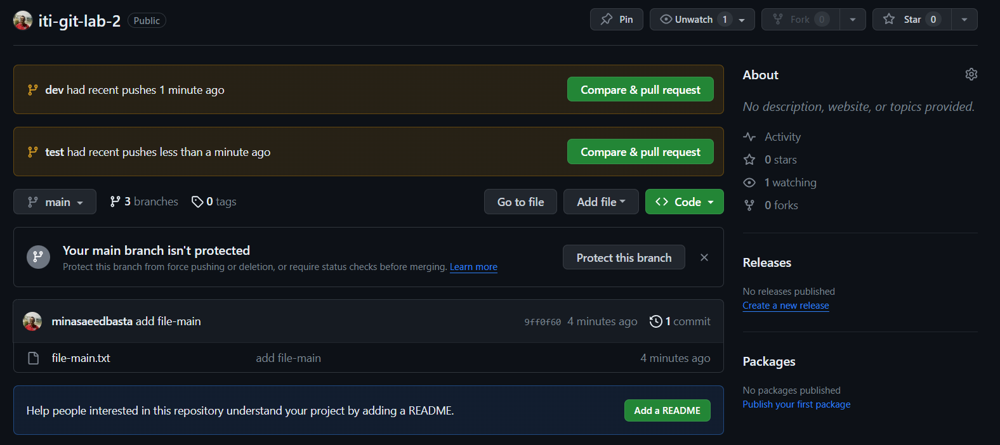
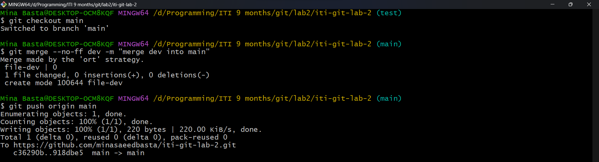
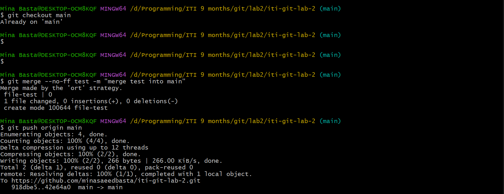
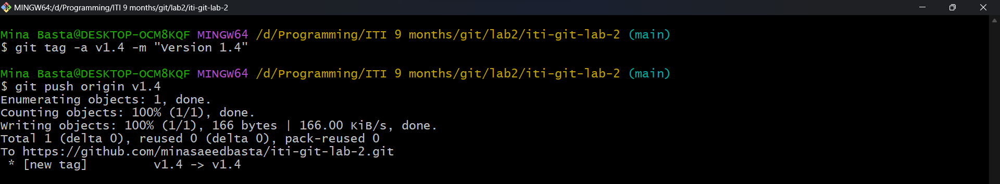

# Project Name

ITI Git Lab 2


## Delete branches

```bash
# Delete local dev branch
git branch -d dev

# Delete local test branch
git branch -d test

# Delete remote dev branch
git push origin :dev

# Delete remote test branch
git push origin :test
```
## List and delete tags

```bash
# List tags
git tag

# Delete a local tag
git tag -d v1.4

# Delete a remote tag
git push origin --delete v1.4
```

## What is Git Rebase ?

```git rebase``` is a Git command used to integrate changes from one branch into another. Unlike ```git merge```, which creates a new commit to combine changes, ```git rebase``` applies changes by moving or combining a sequence of commits to a new base commit. This results in a linear project history, making it easier to understand and navigate.

### Git Rebase Example
```bash
# Initialize a new repository
git init

# Create and switch to a new branch
git checkout -b feature-branch

# Make some changes and commit
echo "Feature 1" > file.txt
git add file.txt
git commit -m "Commit 1"

# Make more changes and commit
echo "Feature 2" >> file.txt
git add file.txt
git commit -m "Commit 2"

# Switch to the main branch
git checkout main

# Make some changes and commit on main
echo "Main changes" > mainfile.txt
git add mainfile.txt
git commit -m "Main Commit 3"

# Rebase feature-branch onto main
git checkout feature-branch
git rebase main

```
### Some Screenshots
#### create two branches


#### merge dev into main


#### merge test into main


#### add tag
